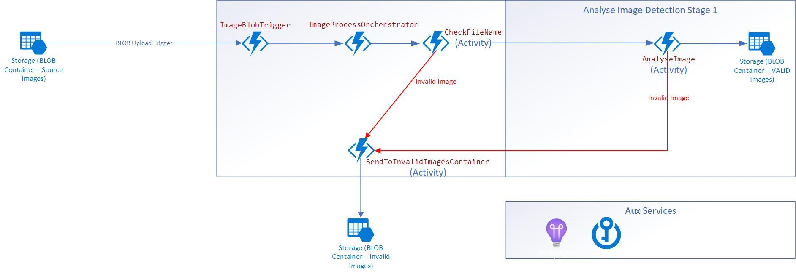

# High Level Architecture

We are proposing the use of Azure Durable Functions which will provide you with a mechanism to better scale long running operations such as image analysis as well as provide for more resiliance through the orcherstrations and activities which behind the scenes are built on top of Azure Storage queues.

More information on [Azure Durable Functions and various patterns.](https://docs.microsoft.com/en-us/azure/azure-functions/durable/durable-functions-overview?tabs=csharp)

# Infra and Permission Pre requisites

| Resource Type | Description |
| --- | --- |
| Storage Account   | Storage Account used by the azure functions |
| Storage Account | General purpose storage account used for image uploads / movement to invalid images / analysed images. For the code sample to work please create the following containers: **inputimages** and **invalidimages**. From a networking lockdown perspective please lock this storage account with private link.|
| App Service Plan    | Dedicated app service plan to host the Azure Functions. You can select OS as either Windows or Linux. ASP Plan type would need to support VNET integration. See more details on plans here: [Functions Premium Plans](https://docs.microsoft.com/en-us/azure/azure-functions/functions-premium-plan?tabs=portal) and [Dedicated Plans](https://docs.microsoft.com/en-us/azure/azure-functions/dedicated-plan)|
| Function App | Brand new Function app on DotNet Core 3.1 Framework (windows / linux - depedant on the above ASP OS selected)

# Function App Settings

For your newly provisoned function app within the app service plan you will need to add the following additional configuration:

1.) App Configuration - Set the following environment variables (App Configuration)
- **INVALID_IMAGES_STORAGE_ACCOUNTNAME** set to your storage account name that will host the images
- **INVALID_IMAGES_BLOB_CONTAINER** set to your invalid images blob container. Example: invalidimages

2.) Enable VNET integation such that Function app can talk to the private link enabled storage account.

3.) Enable [managed identity](https://docs.microsoft.com/en-us/azure/app-service/overview-managed-identity?tabs=dotnet) for the function app

# Storage Account Settings

## Containers
Please provision at very least the following BLOB containers in your storage account:

- inputimages
- invalidimages

## Permissions

You will leverage Function App's managed identity to authenticate into the azure blob storage for storing input, invalid and processed images as opposed to storing storage account connection strings. Please ensure that you assign at very least Storage Blob Data Contributor role against the storage account in question as per https://docs.microsoft.com/en-us/azure/storage/blobs/assign-azure-role-data-access?tabs=portal#assign-an-azure-role.

# Local Development

To locally debug the durable function; depending on your IDE you will need to log in with your user identity against your azure tenant. Ensure that your "azure user" has at very least Storage Blob Data Contributor role against the storage account in question as per https://docs.microsoft.com/en-us/azure/storage/blobs/assign-azure-role-data-access?tabs=portal#assign-an-azure-role.
- [Azure Identity Client Setup for Visual Studio](https://docs.microsoft.com/en-us/dotnet/api/overview/azure/identity-readme)
- [Authenticating via Visual Studio Code](https://docs.microsoft.com/en-us/dotnet/api/overview/azure/identity-readme#authenticating-via-visual-studio-code)

Additionally you will need to provide environment variables locally to your dev environment. One way to perform this is to tweak the local.settings.json file which needs to be stored at function root as per below:

# References

[Durable Functions](https://docs.microsoft.com/en-us/azure/azure-functions/durable/durable-functions-overview?tabs=csharp)

[DefaultAzureCredentials Class](https://docs.microsoft.com/en-us/dotnet/api/azure.identity.defaultazurecredential?view=azure-dotnet)

[DefaultAzureCredential: Unifying How We Get Azure AD Token](https://www.rahulpnath.com/blog/defaultazurecredential-from-azure-sdk/)